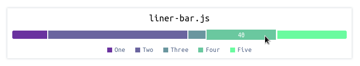

<p align="center"></p>
<h4 align="center">Small horizontal bar chart library</h4>

## Example
```html
<!DOCTYPE html>
<head>
  <link rel="stylesheet" href="./liner-bar.css">
</head>
<body>
  <div style="padding: 50px; width: 700px; margin: auto;">
    <div id="liner-bar">
    </div>
  </div>
  <script src="./liner-bar.js"></script>
  <script>
    const lb = new LinerBar("#liner-bar", {
	title: "liner-bar.js",
	//dark:  true,
	items: [
	    { name: "One",   value: 20, color: "#6a329f" },
	    { name: "Two",   value: 80, color: "#6a649f" },
	    { name: "Three", value: 10, color: "#6a969f" },
	    { name: "Four",  value: 40, color: "#6ac89f" },
	    { name: "Five",  value: 40, color: "#6afb9f" }
	]
    });
    lb.render();
  </script>
</body>
</html>
```